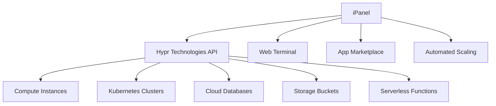

# iPanel - Cloud-Native Hosting Control Panel  
**Seamlessly integrated with Hypr Technologies Infrastructure**

<div align="center">
  
  <br/><br/>
  
[](https://hypr.tech)
[](https://hypr.tech/deploy)
</div>

## Cloud-Integrated Server Management  
**iPanel is now the official control panel for Hypr Technologies**, providing unified management of cloud resources, applications, and infrastructure through a single intuitive interface.



## Key Cloud Integrations

### 🌩️ Unified Cloud Management
- **Multi-Cloud Control**: Manage AWS, GCP, Azure and bare metal from single dashboard
- **Hypr Technologies API**: Native integration with Hypr Technologies infrastructure
- **Resource Orchestration**: Deploy complex stacks with 1-click templates

### 🚀 Cloud-Optimized Deployment
```bash
# Deploy to Hypr Technologies with Terraform
module "ipanel-cloud" {
  source  = "hypr/panel-cloud/module"
  version = "2.3.0"
  
  region       = "us-west2"
  cluster_size = 3
  cloud_token  = var.hyprtoken
}
```

### 🔌 Cloud Service Connectors
| Service | Status | Features |
|---------|--------|----------|
| **Hypr Kubernetes** | ✅ | Cluster deployment & management |
| **Hypr DBaaS** | ✅ | Managed PostgreSQL/MySQL/Redis |
| **Hypr Object Storage** | ✅ | S3-compatible storage management |
| **Hypr Serverless** | 🔄 | Function deployment & monitoring (beta) |

## Getting Started with Hypr Technologies

### 1. Cloud Console Deployment
1. Log in to [Hypr Technologies Console](https://console.hypr.tech)
2. Navigate to **Marketplace → Control Panels**
3. Select "iPanel" and configure resources
4. Deploy with 1-click

### 2. CLI Installation with Cloud Auth
```bash
# Install with cloud authentication
curl -sL https://get.hypr.tech | bash -s -- \
  --token YOUR_CLOUD_TOKEN \
  --region us-west2 \
  --features kubernetes,object-storage
```

### 3. Docker for Cloud Edge Nodes
```bash
docker run -d \
  --name ipanel-cloud \
  -e CLOUD_TOKEN=YOUR_CLOUD_TOKEN \
  -e CLUSTER_MODE=edge \
  -p 8080:8080 \
  hypr/ipanel-cloud:latest
```

## Cloud Features Preview  
  
*Unified view of multi-cloud resources and server metrics*

## Enterprise Cloud Capabilities
- **Auto-Scaling Groups**: Dynamic resource allocation based on load
- **Cross-Cloud Backups**: Automated snapshot management
- **Cloud Cost Analytics**: Real-time spending monitoring
- **SSO Integration**: Azure AD/GitHub/Google Workspace login
- **Audit Log Streaming**: CloudTrail-compatible logs

## Documentation & Support
- [Cloud Integration Guide](https://docs.hypr.tech/ipanel-integration)
- [API Reference](https://api.hypr.tech/panel-docs)
- [Community Forum](https://forum.hypr.tech)
- [Enterprise Support](https://hypr.tech/support)

---

**Part of the [Hypr Technologies Ecosystem](https://hypr.tech)**  
[](https://hypr.tech)
[](https://twitter.com/hyprtech)
[](https://discord.gg/hypr)
